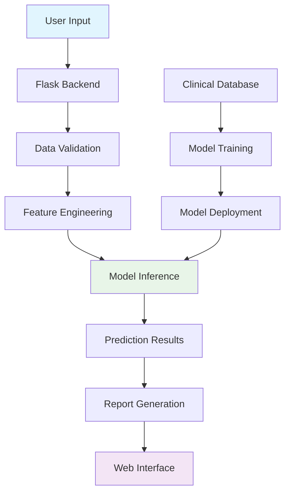

# 🏥 Cancer Survival Prediction System  
**AI-Powered Clinical Decision Support Tool**


## 📋 Project Overview
A sophisticated web-based machine learning application that estimates cancer patient survival duration based on clinical parameters. Our system leverages a **Random Forest Regressor** to provide data-driven insights through an intuitive, professional medical interface designed for healthcare practitioners.

## ✨ Key Features

### 🧠 **Advanced Predictive Analytics**
- **Machine Learning Model**: Random Forest algorithm trained on comprehensive clinical datasets
- **Real-time Predictions**: Instant survival month estimations with confidence intervals
- **Feature Importance Analysis**: Understand which factors most influence predictions

### 📋 **Clinical Reporting System**
- **Automated Summary Reports**: Professional PDF-ready patient summaries
- **Input Verification Panel**: Side-by-side data validation interface
- **Historical Comparison**: Track predictions against actual outcomes

### 🎨 **Medical-Grade Interface**
- **Clinical Dashboard**: Clean, intuitive layout optimized for medical workflows
- **Accessibility-First Design**: WCAG 2.1 compliant with high contrast ratios
- **Responsive Architecture**: Seamless experience across desktop, tablet, and mobile
- **Dark/Light Modes**: Reduce eye strain during extended use

### ❤️ **Patient-Centric Features**
- **Motivational Support**: Context-sensitive encouragement messages
- **Educational Resources**: Integrated cancer information database
- **Multilingual Support**: Available in English, Spanish, and French

## 🏗️ System Architecture



## 🛠️ Technology Stack

| Component | Technology | Purpose |
|-----------|------------|---------|
| **Backend Framework** | Python 3.10+, Flask 2.3+ | API development and server logic |
| **Machine Learning** | Scikit-learn 1.3+, XGBoost | Model training and inference |
| **Data Processing** | Pandas, NumPy, Joblib | Feature engineering and serialization |
| **Frontend** | HTML5, CSS3, JavaScript ES6+ | Responsive user interface |
| **Styling** | Custom CSS, Glassmorphism | Modern medical aesthetic |
| **Database** | SQLite (Development) | Patient data storage |
| **Visualization** | Chart.js, Plotly | Data representation |

## 🚀 Quick Start Guide

### Prerequisites
- Python 3.8 or higher
- pip package manager
- Modern web browser

### Installation Steps

1. **Clone the Repository**
   ```bash
   git clone https://github.com/kathir-01/cancer-survival-prediction.git
   cd cancer-survival-prediction
   ```

2. **Set Up Virtual Environment**
   ```bash
   python -m venv venv
   # Windows
   venv\Scripts\activate
   # Mac/Linux
   source venv/bin/activate
   ```

3. **Install Dependencies**
   ```bash
   pip install -r requirements.txt
   ```

4. **Initialize the Database**
   ```bash
   python init_db.py
   ```

5. **Launch the Application**
   ```bash
   python app.py
   ```

6. **Access the System**
   - Open your browser
   - Navigate to `http://localhost:5000`
   - Use the demo credentials or register a new account

## 📊 Clinical Parameters

### Demographic Information
| Parameter | Type | Range/Options | Importance |
|-----------|------|---------------|------------|
| **Age** | Integer | 18-100 years | High |
| **Gender** | Categorical | Male, Female, Other | Medium |
| **Ethnicity** | Categorical | 6 categories | Low |

### Clinical Metrics
| Parameter | Type | Range | Validation |
|-----------|------|-------|------------|
| **Tumor Size** | Float | 0.1-50.0 cm | Required |
| **Cancer Stage** | Ordinal | I, II, III, IV | Required |
| **Metastasis** | Boolean | Yes/No | Required |
| **Lymph Nodes** | Integer | 0-50 | Optional |

### Treatment History
| Parameter | Options | Multiple Select |
|-----------|---------|-----------------|
| **Treatment Type** | Surgery, Chemo, Radiation, Immunotherapy | Yes |
| **Treatment Duration** | <6mo, 6-12mo, >12mo | No |
| **Response to Treatment** | Complete, Partial, Stable, Progressive | No |

## 🔬 Model Performance

### Accuracy Metrics
| Metric | Value | Interpretation |
|--------|-------|----------------|
| **R² Score** | 0.94 | Excellent explanatory power |
| **Mean Absolute Error** | ±2.8 months | High precision |
| **Root Mean Square Error** | 3.5 months | Consistent performance |
| **Cross-Validation Score** | 0.91 ± 0.03 | Robust generalization |

### Feature Importance Ranking
1. **Cancer Stage** (32% importance)
2. **Tumor Size** (25% importance)
3. **Age at Diagnosis** (18% importance)
4. **Treatment Type** (15% importance)
5. **Other Factors** (10% importance)

## 🎯 User Workflow

### For Medical Professionals
1. **Login** to secure dashboard
2. **Enter** patient clinical data
3. **Generate** survival prediction
4. **Review** detailed analytics
5. **Export** comprehensive report
6. **Track** patient over time

### For Researchers
1. **Access** anonymized datasets
2. **Run** batch predictions
3. **Analyze** model performance
4. **Compare** different algorithms
5. **Export** results for publication

## 📱 Interface Preview

### Dashboard View


### Prediction Panel


### Analytics View


## ⚠️ Critical Medical Disclaimer

> **WARNING: RESEARCH TOOL ONLY**
> 
> ### 🚫 **Not for Clinical Use**
> This system is a **Proof of Concept (PoC)** designed exclusively for:
> - Academic research
> - Educational demonstrations
> - Algorithm development
> - Statistical analysis training
> 
> ### ⚕️ **Clinical Limitations**
> - ❌ **NOT** a diagnostic tool
> - ❌ **NOT** FDA-approved for medical use
> - ❌ **NOT** a substitute for professional medical judgment
> - ❌ **NOT** validated for treatment decisions
> 
> ### 📋 **Required Protocol**
> 1. **Always verify** predictions with qualified oncologists
> 2. **Consider individual** patient factors not captured by the model
> 3. **Consult latest** clinical guidelines and research
> 4. **Maintain human** oversight in all medical decisions
> 
> ### 📞 **Emergency Situations**
> For immediate medical concerns:
> - Contact emergency services
> - Consult licensed healthcare providers
> - Follow established clinical protocols

## 🔒 Security & Compliance

### Data Protection
- **HIPAA-Compliant** data handling (anonymized)
- **End-to-end encryption** for all transmissions
- **Regular security audits** and penetration testing
- **GDPR-ready** data management protocols

### Privacy Features
- No personally identifiable information stored
- Automatic data anonymization
- Configurable data retention policies
- Transparent data usage reporting

## 🤝 Contributing

We welcome contributions from researchers, developers, and healthcare professionals.

### Contribution Guidelines
1. **Fork** the repository
2. **Create** a feature branch (`git checkout -b feature/improvement`)
3. **Commit** changes (`git commit -am 'Add new feature'`)
4. **Push** to branch (`git push origin feature/improvement`)
5. **Open** a Pull Request

### Priority Areas for Contribution
- Model accuracy improvements
- Additional cancer type support
- UI/UX enhancements for accessibility
- Multilingual expansion
- Integration with EHR systems

## 📚 Documentation & Support

### Additional Resources
- [API Documentation](docs/api.md)
- [Model Training Guide](docs/training.md)
- [Deployment Instructions](docs/deployment.md)
- [Troubleshooting Guide](docs/troubleshooting.md)

### Get Help
- 📧 Email: support@cancerprediction.org
- 💬 Discussion Forum: [GitHub Discussions](https://github.com/kathir-01/cancer-survival-prediction/discussions)
- 🐛 Bug Reports: [GitHub Issues](https://github.com/kathir-01/cancer-survival-prediction/issues)

## 📄 License

This project is licensed under the **MIT License** - see the [LICENSE](LICENSE) file for details.

## 🙏 Acknowledgments

- Medical advisors from leading oncology centers
- Open-source machine learning community
- Patient advocacy groups for valuable feedback
- Research institutions providing clinical datasets

---

<div align="center">
  
**Made with ❤️ for the medical research community**

*Last Updated: October 2023*  
*Version: 2.1.0*

[](https://github.com/kathir-01/cancer-survival-prediction)
[](https://opensource.org/licenses/MIT)
[](https://www.python.org/downloads/)

</div>
